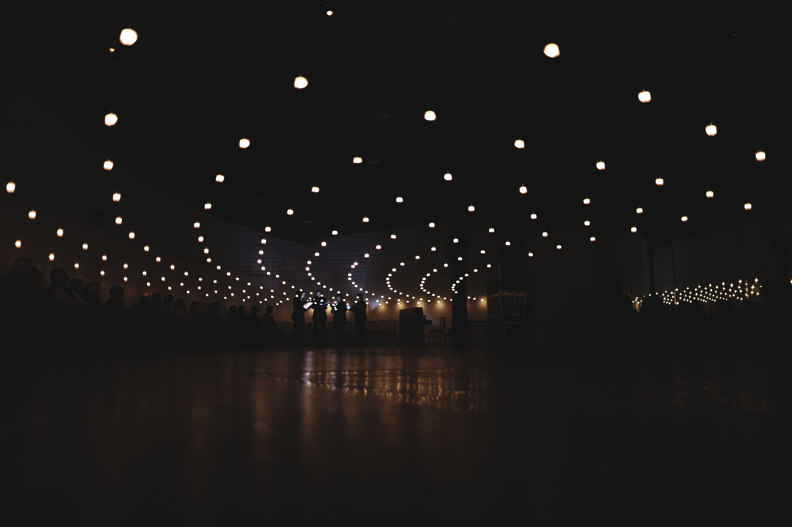
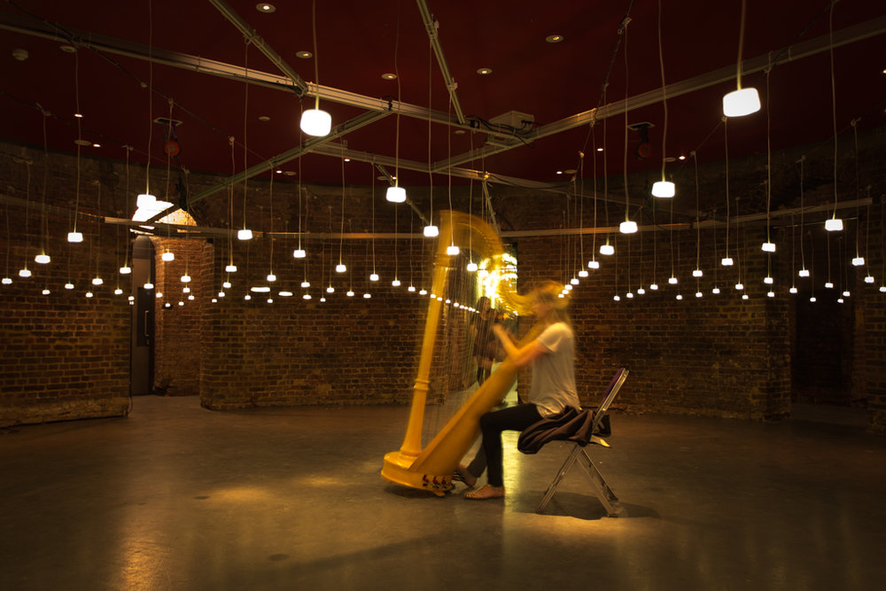
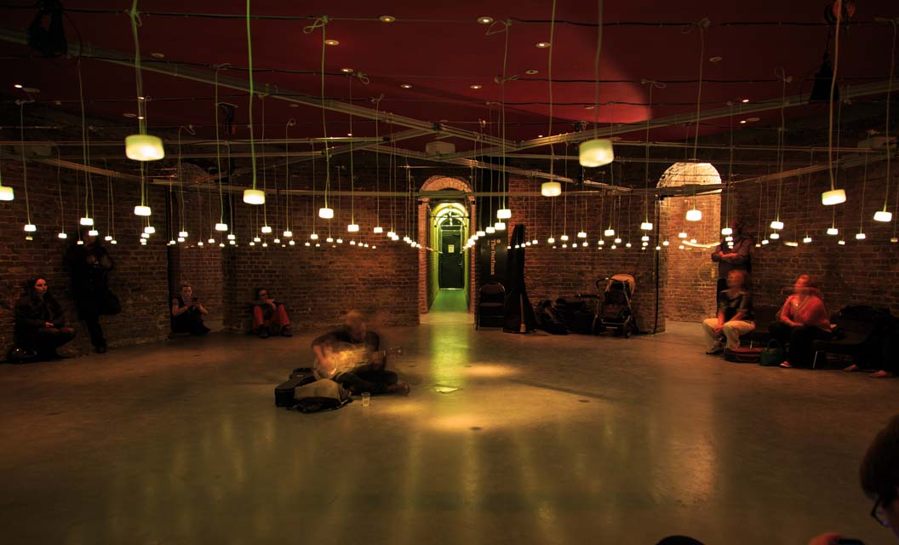
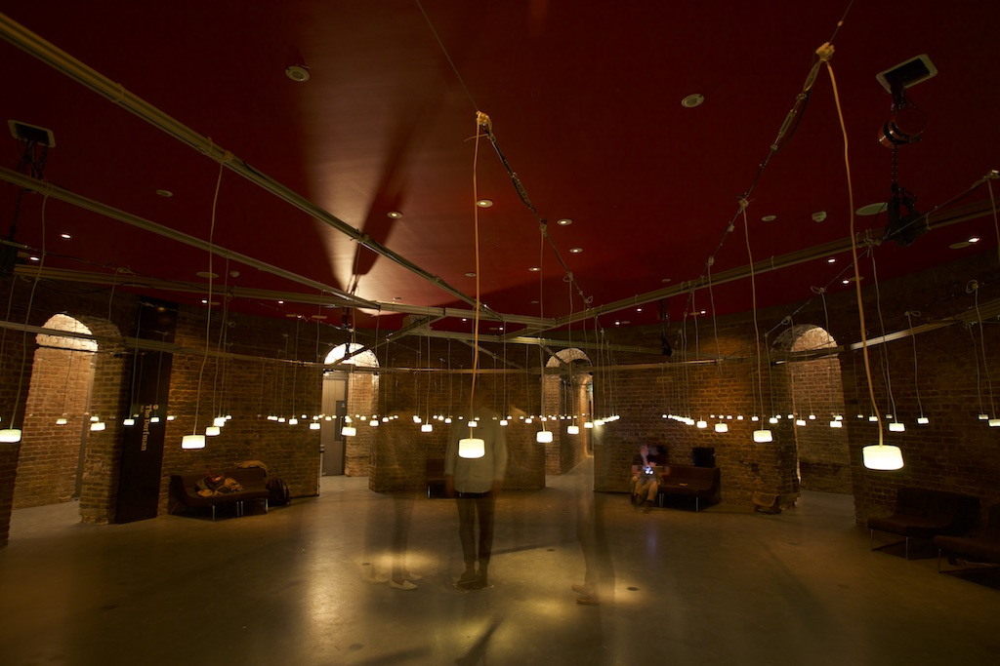
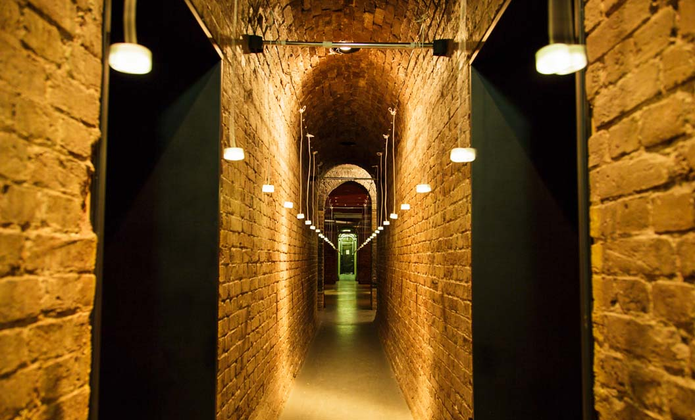

# Helmholtz
*Sound made visible.*  
  
<figure class="figure">
  
</figure> 

Installed at Glasgow Science Centre in 2015, Helmholtz was first presented at Camden’s Roundhouse in 2014. I prototyped, designed and engineered the installation in collaboration with Laurence Love Greed and designer Gyorgyi Galik.

  <iframe class="embed-responsive-item" src="https://player.vimeo.com/video/332469581?loop=1&color=ffffff&byline=0&portrait=0" allowfullscreen></iframe>

<figure class="figure">
  
</figure> 

<blockquote class="blockquote">
  
“The space remains in darkness until you speak, or cough, or clap, or sing – all of which you are encouraged to do. There is even a piano, whispering into individual lights, or calling to a friend standing against a distant wall, the lights crackle into life as clouds, corridors, sheets, and fast moving waves. Like the best interactive, or reactive, applications, the success of the experience is completely dependant upon what – and how much – one personally puts into generating that experience.”

  <footer class="blockquote-footer">Michael Begg in <cite title="Source Title">Total Theatre</cite></footer>
</blockquote>

<figure class="figure">
  
  <figcaption class="figure-caption">Guitarist in Helmholtz.</figcaption>
</figure> 

Helmholtz is designed as a space to encourage musical experimentation. It has set the scene for performances from musicians including Peter Gregson, London Contemporary Choir, Sam Brookes, The Maxwell Quartet and many others. For the Glasgow installation a piano was provided and visitors were encouraged to bring their own instruments. 

<figure class="figure">
  
  <figcaption class="figure-caption">Person in Helmholtz. In reality the installation is dark with only the hanging lights being visible.</figcaption>
</figure> 

<blockquote class="blockquote">
  
“Fascinating watching the various pieces’ textures brought to visual life as the hanging bulbs flickered across the room, and even more intriguing to wonder how particular chords or sounds might be triggering bulbs in unusual patterns, or in lines cutting across the space.”

  <footer class="blockquote-footer"><cite title="Source Title">theartsdesk.com</cite></footer>
</blockquote>

> “Fascinating watching the various pieces’ textures brought to visual life as the hanging bulbs flickered across the room, and even more intriguing to wonder how particular chords or sounds might be triggering bulbs in unusual patterns, or in lines cutting across the space.” — theartsdesk.com

<figure class="figure">
  
  <figcaption class="figure-caption">Helmholtz tunnel.</figcaption>
</figure> 

This installation acts as a demonstration of acoustics – the real physical properties of sound. Each light object is analogue and autonomous without latency or central control, and so gives a realtime indication of the sound pressure level at that point. Combined into a distributed array they create a map of sound as it travels around you. In large spaces you can clap and see the sound travel away from you. You can also see beautiful patterns as different frequencies resonate across the room, this effect is most stark for low-frequency sounds as shown in the videos below.

## More videos

#### Clapping improv

  <iframe class="embed-responsive-item" src="https://player.vimeo.com/video/332469947?loop=0&color=ffffff&byline=0&portrait=0" allowfullscreen></iframe>

  

#### Standing wave 01 

  <iframe class="embed-responsive-item" src="https://player.vimeo.com/video/159096312?loop=0&color=ffffff&byline=0&portrait=0" allowfullscreen></iframe>

  

#### An early prototype

  <iframe class="embed-responsive-item" src="https://player.vimeo.com/video/72452692?loop=0&color=ffffff&byline=0&portrait=0" allowfullscreen></iframe>

  

#### Sam Brookes performance

Sam Brookes performs at the Camden install of Helmholtz, accompanied by the London Contemporary Voices choir.

  <iframe class="embed-responsive-item" src="https://player.vimeo.com/video/112045028?loop=0&color=ffffff&byline=0&portrait=0" allowfullscreen></iframe>

#### Maxwell Quartet performance

A concert by Maxwell Quartet within Helmholtz, Glasgow Science Centre.

  <iframe class="embed-responsive-item" src="https://player.vimeo.com/video/165272526?loop=0&color=ffffff&byline=0&portrait=0" allowfullscreen></iframe>

